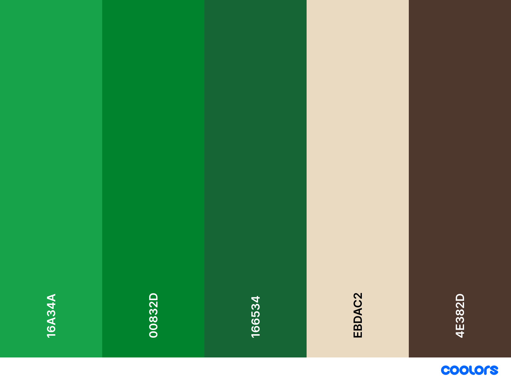
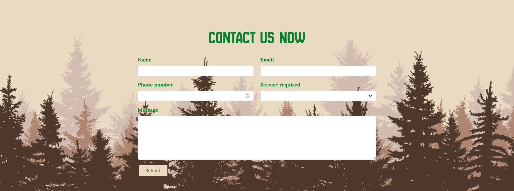
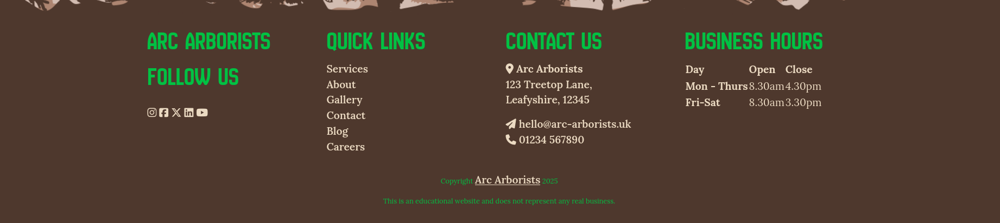

# [Arc Arborists](https://runwiththerhythm.github.io/arc-arborists)

- Arc Arborists is a business website for a fictional arboricultural company called 'Arc Arborists'.
- The website aims to promote the services of the business and generate leads for them. 
- It displays all relevant information about the business, highlights their expertise and experience and showcases them to potential customers.
- The target audience is potential customers who are looking to get arboricultural services and they will benefit from the website by being able to find out more about the company and the services they offer, as well as find reassurance why to hire them from evidence of previous work.

## Live project
[View the live project here.](https://runwiththerhythm.github.io/arc-arborists/)

## Screenshots

to be added when complete

## User experience

### User stories

- #### New Visitor
  - As a first time visitor, I need easy navigation and a user-friendly design, including a responsive layout for my device, so I can find information quickly and efficiently without frustration.
  - As a first time visitor, I want to easily understand the main purpose of the website and learn about the arborist services offered.
  - As a first time visitor, I want to be able to navigate easily through the site to find the services offered and contact information.
  - As a first time visitor, I want to read testimonials from previous clients to see if the business is trustworthy and reliable.
  - As a first time visitor, I want to locate the businesses certifications and qualifications to ensure they are licensed professionals and operate safely.

- #### Repeat Visitor
  - As a Returning Visitor, I want to find the contact details quickly so I can request a quote or schedule a consultation.
  - As a Returning Visitor, I want to find out more information about the company to see if they are a suitable fit for my purpose.
  - As a Returning Visitor, I want to see examples of completed projects, such as tree removals, pruning, or other arborist work, to help me decide on hiring them.

- #### Business Owner
  - As the Business Owner, I want the website to clearly showcase my expertise and certifications to build trust with potential clients.
  - As the Business Owner, I want to feature a blog or resource section to establish authority in the industry and drive more traffic to the site via SEO.
  - As the Business Owner, I want the website to generate leads by including strong calls-to-action, such as 'Get a Free Quote' or 'Schedule a Consultation'.
  - As the Business Owner, I want to prominently display information about our emergency 24/7 service with out of hours contact details.
  - As the Business Owner, I want to feature a Careers page to attract new employees.

### The 5 Planes of UX

#### 1. Strategy Plane
##### Purpose
- Promote the business and the services they offer.
- Generate new leads for the business.
- Provide a seamless user experience to allow the customer to intuitively navigate around the website and get know the business.

##### Primary User Needs
- Learn about the business and the services they provide.
- Be reassured the business is authentic and reputable.
- Contact the business easily and quickly.

##### Business Goals
- Generate new customers.
- Display experience, expertise and services offered.
- Have a fully responsive, professional looking website.
- Encourage potential new employees to get in touch.

#### 2. Scope Plane
##### Features
- A full list of [Features](#features) can be viewed in detail below.

##### Content Requirements
- Clearly display services offered.
- Emergency contact details / service.
- Contact form with selection of enquires.
- Forms for membership sign-up.
- High quality images of previous work.
- Careers page to attract new employees.

#### 3. Structure Plane
##### Information Architecture
- **Navigation Menu**:
  - Company logo
  - Phone number
  - Accessible links in the navbar.
- **Hierarchy**:
  - Eye catching Hero section
  - Clear call-to-action buttons.
  - Services section first as most important
  - Gallery of past work
  - Contact form above the footer
  - Quick links and contact info in footer
  - Prominent placement of social media links in the footer.

##### User Flow
1. User lands on the home page and meets the business.
2. Can select links from navigation or CTA hero buttons.
3. Scrolls further down the page to learn more about the business.
4. Contacts the business using the contact form.
5. Uses navigation links in footer to be taken to another page.
6. Scrolling the page always ends up at the contact form.

#### 4. Skeleton Plane
##### Wireframes

#### 5. Surface Plane
##### Visual Design Elements
### Colour scheme

Shades of green and light and dark brown, chosen to reflect the leaves, wood and bark of trees and to provide contrast between the colours.

### Typography

- __New Amsterdam__
  - A bold and commanding uppercase font used for headings and buttons.
- __Lora__
  - A modern serif font with great readability and an organic feel that balances the heading font. Used throughout the main body.

## Pages and Features 

In this section, you should go over the different parts of your project, and describe each in a sentence or so. You will need to explain what value each of the features provides for the user, focusing on who this website is for, what it is that they want to achieve and how your project is the best way to help them achieve these things.

### Global Header

- __Navigation Bar__

  - Found on all pages, the fully responsive navigation bar features the companies logo and name which links to the Home page. Their phone number, which is a clickable link to call them.
  - The first thing the user sees is a logo of a tree letting them know immediately the kind of business they are viewing.
  - The main navigation menu features links to the Home page, a dropdown menu links to sections of the Services page, also links to the About page, Gallery section, Contact section, Blog and a CTA button that takes you straight to the contact form.
  - The navbar is identical on each page to allow for easy navigation and consistency across all devices without having to revert back to the previous page via the ‘back’ button. 

### Home Page

- __Hero Section__

  - The Hero section includes a carousel of high quality images and an impactful and concise headline and sub-headline that describes the business and what they provide.
  - This section introduces the user to Arc Arborists with an eye catching animation to grab their attention and the ability to interact with the carousel to view through the photos.
  - Two CTA buttons allow the use to quickly access the Contact form for a quote and emergency assistance saving them time for the most common and important actions.

- __Our Services__

  - The 'Our Services' title is visible in the above-the-fold section to entice the user to scroll down and let them know there is more information to view below.
  - Three large 'Services' cards with high quality images, representative icons, and SEO keyword rich descriptions of the businesses key services.
  - This will allow the user to clearly get an idea of the main types of services offered by the business.
  - Smaller 'Services' cards with visually descriptive icons and SEO keyword rich titles of more of the businesses services.
  - This gives the user more information on other services the business offers and eye catching icons help visually inform of the service.

- __Testimonials__

  - The 'Testimonials' will provide the user with reviews of the company and supporting statements from previous clients.
  - This section is valuable to the user as they will be able to see evidence of previous satisfied clients giving them a sense of reassurance when deciding to hire the company.
 
- __Gallery__

  - The 'Gallery' section displays a masonry carousel of high quality images of the businesses work and services and the team in action. 
  - This section is valuable to the user as they will be able to see evidence of the team working and work they have carried out in the past, again reassuring the user and giving good promotion to the business. 

### Global Footer

- __Contact Form__

  - This section allows the user to contact the company. The user is asked to submit their name, email address, phone number and message. 
  - To provide the most information to the business about the user request, all fields are required and there is a dropdown menu to select the service required.

- __Footer__ 

  - The footer section includes links to the relevant social media sites for Arc Arborists. The links will open in a new tab to allow easy navigation for the user and so as not to lose them from our site. 
  - The text has a drop shadow outline to ensure it can be seen clearly even when the background colour changes across different devices and screen sizes.
  - The footer is valuable to the user as it encourages them to keep connected via social media and provides navigation and business information.

### Services Page

  - The Services page further details the main services offered by the company in an informative and SEO keyword rich manner. There are high quality images for each section, a brief description and list of relevant services.
  - Each section is linked to from the Home page and Navigation
  - Emergency out of hours contact details are styled bold and bright red for the user to easily spot in an urgent and time sensitive situation.

### About Page

- __Introduction__

  - A brief description about the company to introduce the business.
  - This lets potential customers know more about the business and their values.

- __Meet our Team__

  - The Team section introduces the main team members of the business.
  - It features a circular photograph, name, role and description for each member.
  - This allows visitors to connect with the business on a more personal level and builds trust and reassurance.

- __Recruitment__

  - This sections links to the Careers page.
  - As well as providing value to potential employees it helps SEO as an internal link.

### Blog Page

WORK IN PROGRESS

### Careers Page

WORK IN PROGRESS

## Technologies used

### Languages
- [HTML](https://en.wikipedia.org/wiki/HTML5)
- [CSS](https://en.wikipedia.org/wiki/CSS)

### Frameworks, Libraries etc

- [Bootstrap 5.3](https://getbootstrap.com/docs/5.3/getting-started/introduction/)

## Testing 

In this section, you need to convince the assessor that you have conducted enough testing to legitimately believe that the site works well. Essentially, in this part you will want to go over all of your project’s features and ensure that they all work as intended, with the project providing an easy and straightforward way for the users to achieve their goals.

In addition, you should mention in this section how your project looks and works on different browsers and screen sizes.

You should also mention in this section any interesting bugs or problems you discovered during your testing, even if you haven't addressed them yet.

When testing my project using lighthouse I found the following issues and improved the improve the site.

- Images were too large and this was impacting loading times. To fix this I resized the images and improved the load time.
- ........????????? anything else?

| Feature                                 | Test Case                                      | Outcome                                                         |
| --------------------------------------- | ---------------------------------------------- | --------------------------------------------------------------- |
| Logo                                    | Click the logo                                 | User is taken to the Home page                                  |
| Navbar \| Home page                     | Click 'Home' link on each page                 | User is taken to the Home page                                  |
| Navbar \| Services links                | Click 'Services' menu links on each page       | User is taken to the corresponding pages                        |
| Navbar \| About                         | Click 'About' link on each page                | User is taken to the 'About' page                               |
| Navbar \| Gallery                       | Click 'Gallery' link on each page              | User is taken to the gallery section on the Home page           |
| Navbar \| Contact                       | Click 'Contact' link on each page              | User is taken to the Contact form                               |
| Navbar \| Blog                          | Click 'Blog' link on each page                 | Use is taken to the 'Blog' page                                 |
| Navbar \| Quote CTA                     | Click the 'Get a quote' CTA on each page       | User is taken to the Contact form                               |
| Hero Buttons \| Quote                   | Click on the 'Get a free quotation now' button | User is taken to the Contact form                               |
| Hero Buttons \| Emergency               | Click on the 'Emergency tree care..' button    | User is taken to Emergency tree care section on 'Services' page |
| Our Services \| Tree Surgery            | Click the 'Learn more' button                  | User is taken to Tree Surgery section on 'Services' page        |
| Our Services \| Tree Surveys            | Click the 'Learn more' button                  | User is taken to Tree Survey section on 'Services' page         |
| Our Services \| Emergency Tree Services | Click the 'Learn more' button                  | User is taken to Emergency Tree Care section on 'Services' page |
|                                         |                                                |                                                                 |
|                                         |                                                |                                                                 |
|                                         |                                                |                                                                 |
|                                         |                                                |                                                                 |
|                                         |                                                |                                                                 |
| Contact Form                            | Submit an empty form                           | Error for required field to be filled out                       |
| Contact Form \| Name                    | Submit with empty field                        | Error for required field to be filled out                       |
| Contact Form \| Email                   | Submit text string without @                   |                                                                 |
| Contact Form \| Phone number            | Submit text string without numbers             |                                                                 |
| Contact Form \| Service required        |                                                |                                                                 |
| Contact Form \| Message                 |                                                |                                                                 |

### Validator Testing 

- HTML
  - No errors were returned when passing through the official [W3C validator](https://validator.w3.org/nu/?doc=https%3A%2F%2Fcode-institute-org.github.io%2Flove-running-2.0%2Findex.html)
- CSS
  - No errors were found when passing through the official [(Jigsaw) validator](http://jigsaw.w3.org/css-validator/validator?lang=en&profile=css3svg&uri=https%3A%2F%2Frunwiththerhythm.github.io%2Farc-arborists%2F&usermedium=all&vextwarning=&warning=1)

### Unfixed Bugs

You will need to mention unfixed bugs and why they were not fixed. This section should include shortcomings of the frameworks or technologies used. Although time can be a big variable to consider, paucity of time and difficulty understanding implementation is not a valid reason to leave bugs unfixed. 

## Deployment

- The site was deployed to GitHub pages. The steps to deploy are as follows: 
  - In the GitHub repository, navigate to the 'Settings' tab 
  - In the Settings page select 'Pages' from the menu
  - Options should be set to; Source - Deploy from a branch, Branch - main, root.
  - Click Save.

The live link can be found here - https://runwiththerhythm.github.io/arc-arborists/

## Acknowledgements  

### Content 

- Some content has been created with the assistance of AI.

### Media

- Stock images are from [Canva](https://canva.com/) and <a href="https://unsplash.com/photos/man-cutting-brown-tree-during-daytime-_b9mXKt0fc4?utm_content=creditCopyText&utm_medium=referral&utm_source=unsplash">Unsplash</a>
      

### Icons

- The majority of icons used are from [Flaticon](https://www.flaticon.com/icons/)
- Created by [juicy_fish](https://www.flaticon.com/authors/juicy-fish/), [Freepik](https://www.flaticon.com/authors/freepik), [Backwoods](https://www.flaticon.com/authors/backwoods),
- [Bootstrap Icons](https://icons.getbootstrap.com/)
- Custom created SVGs