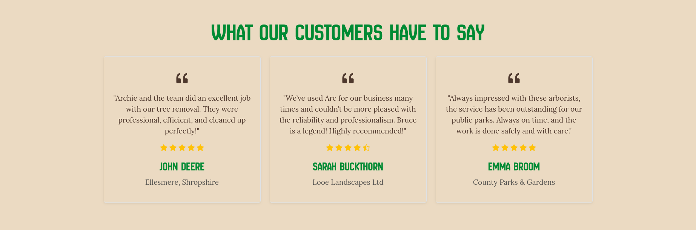
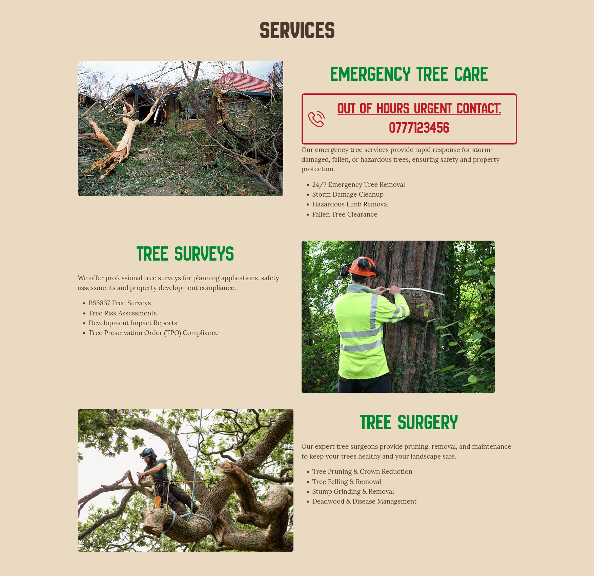

# [Arc Arborists](https://runwiththerhythm.github.io/arc-arborists)

- Arc Arborists is a business website for a fictional arboricultural company called 'Arc Arborists'.
- The website aims to promote the services of the business, generate leads for them and attract potential new employees. 
- It displays relevant information about the business, highlights their expertise and experience and showcases them to potential customers.
- The target audience is potential customers who are looking for arboricultural services.
- They will benefit from the website by being able to find out more about the company and the services they offer, as well as find reassurance to hire them from evidence of previous work.

## Live project
[View the live project here.](https://runwiththerhythm.github.io/arc-arborists/)

## User experience

### The 5 Planes of UX

#### 1. Strategy Plane
##### Purpose
- Promote the business and the services they offer.
- Generate new leads for the business.
- Provide a seamless user experience to allow the customer to intuitively navigate around the website and get know the business.

##### Primary User Needs
- Learn about the business and the services they provide.
- Be reassured the business is authentic and reputable.
- Contact the business easily and quickly.

##### Business Goals
- Generate new customers.
- Display experience, expertise and services offered.
- Have a fully responsive, professional looking website.
- Encourage potential new employees to get in touch.

#### 2. Scope Plane
- A full list of [Features](#features) can be viewed in detail below.

##### Content Requirements
- Clearly display services offered.
- Emergency contact details / service.
- Contact form with selection of enquires.
- Forms for membership sign-up.
- High quality images of previous work.
- Careers page to attract new employees.

#### 3. Structure Plane
##### Information Architecture
- **Navigation Menu**:
  - Company logo.
  - Phone number.
  - Accessible links in the navbar.
- **Hierarchy**:
  - Eye catching Hero section.
  - Clear call-to-action buttons.
  - Services section first as most important.
  - Gallery of past work.
  - Contact form above the footer.
  - Quick links and contact info in footer.
  - Prominent placement of social media links in the footer.

##### User Flow
1. User lands on the home page and meets the business.
2. Can select links from navigation or CTA hero buttons.
3. Scrolls further down the page to learn more about the business.
4. Contacts the business using the contact form.
5. Uses navigation links in footer to be taken to another page.
6. Scrolling the page always ends up at the contact form.

#### 4. Skeleton Plane
##### Wireframes Ideas
 - Sitemap
 - To follow best practice, wireframes were developed for mobile, tablet, and desktop sizes.

#### 5. Surface Plane
#### Visual Design Elements
##### Colour scheme

Shades of green and light and dark brown, chosen to reflect the leaves, wood and bark of trees and to provide contrast between the colours.

### Typography

- [New Amsterdam](https://fonts.google.com/specimen/New+Amsterdam)
  - A bold and commanding, sans-serif, uppercase font used for headings and buttons.
- [Lora](https://fonts.google.com/specimen/Lora)
  - A modern serif font with great readability and an organic feel that balances the heading font. Used throughout the main body.
- [Font Awesome](https://fontawesome.com/icons)
  - Font Awesome icons are used in the footer for social media links.

### User stories

- #### New Visitor
  - As a first time visitor, I need easy navigation and a user-friendly design, including a responsive layout for my device, so I can find information quickly and efficiently without frustration.
  - As a first time visitor, I want to easily understand the main purpose of the website and learn about the arborist services offered.
  - As a first time visitor, I want to be able to navigate easily through the site to find the services offered and contact information.
  - As a first time visitor, I want to read testimonials from previous clients to see if the business is trustworthy and reliable.
  - As a first time visitor, I want to locate the businesses certifications and qualifications to ensure they are licensed professionals and operate safely.

- #### Repeat Visitor
  - As a Returning Visitor, I want to find the contact details quickly so I can request a quote or schedule a consultation.
  - As a Returning Visitor, I want to find out more information about the company to see if they are a suitable fit for my purpose.
  - As a Returning Visitor, I want to see examples of completed projects, such as tree removals, pruning, or other arborist work, to help me decide on hiring them.

- #### Business Owner
  - As the Business Owner, I want the website to clearly showcase my expertise and certifications to build trust with potential clients.
  - As the Business Owner, I want to feature a blog or resource section to establish authority in the industry and drive more traffic to the site via SEO.
  - As the Business Owner, I want the website to generate leads by including strong calls-to-action, such as 'Get a Free Quote' or 'Schedule a Consultation'.
  - As the Business Owner, I want to prominently display information about our emergency 24/7 service with out of hours contact details.
  - As the Business Owner, I want to feature a Careers page to attract new employees.

## Features 

### Global Header

- __Navigation Bar__

  - Found on all pages, the fully responsive navigation bar features the companies logo and name which links to the Home page. Their phone number, which is a clickable link to call them.
  - The first thing the user sees is a logo of a tree letting them know immediately the kind of business they are viewing.
  - The main navigation menu features links to the Home page, a dropdown menu links to sections of the Services page, also links to the About page, Gallery section, Contact section, Blog and a CTA button that takes you straight to the contact form.
  - The navbar is identical on each page to allow for easy navigation and consistency across all devices without having to revert back to the previous page via the ‘back’ button. 

### Home Page

- __Hero Section__

  - The Hero section includes a carousel of high quality images and an impactful and concise headline and sub-headline that describes the business and what they provide.
  - This section introduces the user to Arc Arborists with an eye catching animation to grab their attention and the ability to interact with the carousel to view through the photos.
  - Two CTA buttons allow the use to quickly access the Contact form for a quote and emergency assistance saving them time for the most common and important actions.

- __Our Services__

  - The 'Our Services' title is visible in the above-the-fold section to entice the user to scroll down and let them know there is more information to view below.
  - Three large 'Services' cards with high quality images, representative icons, and SEO keyword rich descriptions of the businesses key services.
  - This will allow the user to clearly get an idea of the main types of services offered by the business.
  
  

  - Smaller 'Services' cards with visually descriptive icons and SEO keyword rich titles of more of the businesses services.
  - This gives the user more information on other services the business offers and eye catching icons help visually inform of the service.

- __Testimonials__

  - The 'Testimonials' will provide the user with reviews of the company and supporting statements from previous clients.
  - This section is valuable to the user as they will be able to see evidence of previous satisfied clients giving them a sense of reassurance when deciding to hire the company.

 
- __Gallery__

  - The 'Gallery' section displays a masonry carousel of high quality images of the businesses work and services and the team in action. 
  - This section is valuable to the user as they will be able to see evidence of the team working and work they have carried out in the past, again reassuring the user and giving good promotion to the business. 

### Global Footer

- __Contact Form__

  - This section allows the user to contact the company. The user is asked to submit their name, email address, phone number and message. 
  - To provide the most information to the business about the user request, all fields are required and there is a dropdown menu to select the service required.

- __Footer__ 

  - The footer section includes links to the relevant social media sites for Arc Arborists. The links will open in a new tab to allow easy navigation for the user and so as not to lose them from our site. 
  - The text has a drop shadow outline to ensure it can be seen clearly even when the background colour changes across different devices and screen sizes.
  - The footer is valuable to the user as it encourages them to keep connected via social media and provides navigation and business information.

### Services Page

  - The Services page further details the main services offered by the company in an informative and SEO keyword rich manner. There are high quality images for each section, a brief description and list of relevant services.
  - Each section is linked to from the Home page and Navigation
  - Emergency out of hours contact details are styled bold and bright red for the user to easily spot in an urgent and time sensitive situation.

### About Page

- __Introduction__

  - A brief description about the company to introduce the business.
  - Appropriate certifications of qualifications and skills are displayed.
  - This lets potential customers know more about the business, their values and there expertise.

- __Meet our Team__

  - The Team section introduces the main team members of the business.
  - It features a circular photograph, name, role and description for each member.
  - This allows visitors to connect with the business on a more personal level and builds trust and reassurance.

- __Recruitment__

  - This sections links to the Careers page.
  - As well as providing value to potential employees it helps SEO and navigation as an internal link.

### Careers Page

- __Work with us__

  - This section lists some of the benefits of working with the company.

- __Current Opportunities__

  - The rest of the page provides detail of current vacancies and training opportunities.
  - This provides value to the business owner to find new staff and makes it easy for potential employees to see details about vacancies with details to apply.

### Future Features

- Blog
  - A blog will be implemented in the future to provide resources for users and the improve SEO for the business.
- Booking system
  - A booking system could be implemented to allow users to book a specific time for their initial consultation.
- Location Map

  - A google map of the companies location could be added to improve their local SEO and allow clients to locate their offices.

## Technologies used

### Languages
- [HTML](https://en.wikipedia.org/wiki/HTML5)
- [CSS](https://en.wikipedia.org/wiki/CSS)

### Frameworks, Libraries etc

- [Bootstrap 5.3](https://getbootstrap.com/docs/5.3/getting-started/introduction/)

## Testing 

In addition, you should mention in this section how your project looks and works on different browsers and screen sizes.

You should also mention in this section any interesting bugs or problems you discovered during your testing, even if you haven't addressed them yet.

When testing my project using lighthouse I found the following issues and improved the improve the site.

- Images were too large and this was impacting loading times. To fix this I resized the images and improved the load time.
- ........????????? anything else?

| Feature                                 | Test Case                                      | Outcome                                                         |
| --------------------------------------- | ---------------------------------------------- | --------------------------------------------------------------- |
| Logo                                    | Click the logo                                 | User is taken to the Home page                                  |
| Navbar \| Home page                     | Click 'Home' link on each page                 | User is taken to the Home page                                  |
| Navbar \| Services links                | Click 'Services' menu links on each page       | User is taken to the corresponding pages                        |
| Navbar \| About                         | Click 'About' link on each page                | User is taken to the 'About' page                               |
| Navbar \| Gallery                       | Click 'Gallery' link on each page              | User is taken to the gallery section on the Home page           |
| Navbar \| Contact                       | Click 'Contact' link on each page              | User is taken to the Contact form                               |
| Navbar \| Blog                          | Click 'Blog' link on each page                 | Use is taken to the 'Blog' page                                 |
| Navbar \| Quote CTA                     | Click the 'Get a quote' CTA on each page       | User is taken to the Contact form                               |
| Hero Buttons \| Quote                   | Click on the 'Get a free quotation now' button | User is taken to the Contact form                               |
| Hero Buttons \| Emergency               | Click on the 'Emergency tree care..' button    | User is taken to Emergency tree care section on 'Services' page |
| Our Services \| Tree Surgery            | Click the 'Learn more' button                  | User is taken to Tree Surgery section on 'Services' page        |
| Our Services \| Tree Surveys            | Click the 'Learn more' button                  | User is taken to Tree Survey section on 'Services' page         |
| Our Services \| Emergency Tree Services | Click the 'Learn more' button                  | User is taken to Emergency Tree Care section on 'Services' page |
| Contact Form                            | Submit an empty form                           | Error for required field to be filled out                       |
| Contact Form \| Name                    | Submit with empty field                        | Error for required field to be filled out                       |
| Contact Form \| Email                   | Submit text string without @                   | Error for required field to be filled out                                                                |
| Contact Form \| Phone number            | Submit text string without numbers             | Error for required field to be filled out                                                                |
| Contact Form \| Service required        | Submit with no option selected                                               | Error for required field to be filled out                                                                |
| Contact Form \| Message                 | Submit with no message                                               | Error for required field to be filled out                                                                |
| About page \| YouTube video                 | Click to play to video                                               | Video plays successfully                                                                |

### Validator Testing 

- HTML
  - No errors were returned when passing through the official [W3C validator](https://validator.w3.org/nu/?doc=https%3A%2F%2Fcode-institute-org.github.io%2Flove-running-2.0%2Findex.html)
- CSS 
  - No errors were found when passing through the official [(Jigsaw) validator](http://jigsaw.w3.org/css-validator/validator?lang=en&profile=css3svg&uri=https%3A%2F%2Frunwiththerhythm.github.io%2Farc-arborists%2F&usermedium=all&vextwarning=&warning=1)

### Responsive Testing 

I've tested my deployed project to check for responsiveness issues.

| Page | Mobile | Tablet | Desktop | Notes |
| --- | --- | --- | --- | --- |
| Home |  |  |  | Works as expected |
| Gallery |  |  |  | Works as expected |
| Signup |  |  |  | Works as expected |
| Confirmation |  |  |  | Works as expected |
| 404 |  |  |  | Works as expected |

## Browser Compatibility

The deployed site has been tested using the following browsers to check for compatibility issues.
- [Chrome](https://www.google.com/chrome)
- [Firefox](https://www.mozilla.org/firefox)
- [Brave](https://brave.com/download)

| Page | Chrome | Firefox | Safari | Notes |
| --- | --- | --- | --- | --- |
| Home |  |  |  | Works as expected |
| Services |  |  |  | Works as expected |
| About |  |  |  | Works as expected |
| Careers |  |  |  | Works as expected |
| 404 |  |  |  | Works as expected |

## Lighthouse Audit

⚠️ INSTRUCTIONS ⚠️

Use this space to discuss testing the live/deployed site's Lighthouse Audit reports. Avoid testing the local version (Gitpod/VSCode/etc.), as this can have knock-on effects for performance. If you don't have "Lighthouse" in your Developer Tools, it can be added as an [extension](https://chrome.google.com/webstore/detail/lighthouse/blipmdconlkpinefehnmjammfjpmpbjk).

Unless your project is a single-page application (SPA), you should test Lighthouse Audit results for all of your pages, for both *mobile* and *desktop*.

**IMPORTANT**: You must provide screenshots of the results, to "prove" that you've actually tested them.

⚠️ --- END --- ⚠️

I've tested my deployed project using the Lighthouse Audit tool to check for any major issues. Some warnings are outside of my control, and mobile results tend to be lower than desktop.

| Page | Mobile | Desktop |
| --- | --- | --- |
| Home |  |  |
| Gallery |  |  |
| Signup |  |  |
| Confirmation |  |  |
| 404 |  |  |

## Defensive Programming

Areas of user input have been tested 

## Bugs

If/when you encounter bugs during the development stages of your project, you should document them here, ideally with a screenshot explaining what the issue was, and what you did to fix the bug.

Alternatively, an improved way to manage bugs is to use the built-in **[Issues](https://www.github.com/runwiththerhythm/arc-arborists/issues)** tracker on your GitHub repository. This can be found at the top of your repository, the tab called "Issues".

If using the Issues tracker for bug management, you can simplify the documentation process for testing. Issues allow you to directly paste screenshots into the issue page without having to first save the screenshot locally. You can add labels to your issues (e.g. `bug`), assign yourself as the owner, and add comments/updates as you progress with fixing the issue(s). Once you've solved the issue/bug, you should then "Close" it.

When showcasing your bug tracking for assessment, you can use the following examples below.

### Fixed Bugs

I've used [GitHub Issues](https://www.github.com/runwiththerhythm/arc-arborists/issues) to track and manage bugs and issues during the development stages of my project.

All previously closed/fixed bugs can be tracked [here](https://www.github.com/runwiththerhythm/arc-arborists/issues?q=is%3Aissue+is%3Aclosed+label%3Abug).

### Unfixed Bugs

You will need to mention any unfixed bugs and why they are not fixed upon submission of your project. This section should include shortcomings of the frameworks or technologies used. Although time can be a big variable to consider, paucity of time and difficulty understanding implementation is not a valid reason to leave bugs unfixed. Where possible, you must fix all outstanding bugs, unless outside of your control.

If you've identified any unfixed bugs, no matter how small, be sure to list them here! It's better to be honest and list them, because if it's not documented and an assessor finds the issue, they need to know whether or not you're aware of them as well, and why you've not corrected/fixed them.

Any remaining open issues can be tracked [here](https://www.github.com/runwiththerhythm/arc-arborists/issues).

### Known Issues

Due to the colour variation in the footer image, I have used a drop show effect to outline some of the text to ensure it can be read easily across all devices. This has caused issue with some colour contrast checkers, however I have made changes to the shades of green used to ensure the best contrast between foreground and background colours across the site.

My initial commit messages did not start with a capital letter and were not always descriptive enough. After some helpful advice from my Code Institute mentor I have improved these since.

| Issue | Screenshot |
| --- | --- |
| On devices smaller than 375px, the page starts to have horizontal `overflow-x` scrolling. |  |
| When validating HTML with a semantic `<section>` element, the validator warns about lacking a header `h2-h6`. This is acceptable. |  |

> [!IMPORTANT]
> After having tested the site thoroughly, there are no remaining bugs that I am aware of, however there is always a small possibility something may have been missed or not initiated.

## Deployment

### GitHub Pages

The site was deployed to GitHub Pages.
The live link can be found on [GitHub Pages](https://runwiththerhythm.github.io/arc-arborists).
The steps to deploy are as follows:

- In the [GitHub repository](https://www.github.com/runwiththerhythm/arc-arborists), navigate to the "Settings" tab.
- In Settings, click on the "Pages" link from the menu on the left.
- From the "Build and deployment" section, click the drop-down called "Branch", and select the **main** branch, then click "Save".
- The page will be automatically refreshed with a detailed message display to indicate the successful deployment.
- Allow up to 5 minutes for the site to fully deploy.

### Local Development

This project can be cloned or forked in order to make a local copy on your own system.

#### Cloning

You can clone the repository by following these steps:

1. Go to the [GitHub repository](https://www.github.com/runwiththerhythm/arc-arborists).
2. Locate and click on the green "Code" button at the very top, above the commits and files.
3. Select whether you prefer to clone using "HTTPS", "SSH", or "GitHub CLI", and click the "copy" button to copy the URL to your clipboard.
4. Open "Git Bash" or "Terminal".
5. Change the current working directory to the location where you want the cloned directory.
6. In your IDE Terminal, type the following command to clone the repository:
	- `git clone https://www.github.com/runwiththerhythm/arc-arborists.git`
7. Press "Enter" to create your local clone.

#### Forking

By forking the GitHub Repository, you make a copy of the original repository on our GitHub account to view and/or make changes without affecting the original owner's repository. You can fork this repository by using the following steps:

1. Log in to GitHub and locate the [GitHub Repository](https://www.github.com/runwiththerhythm/arc-arborists).
2. At the top of the Repository, just below the "Settings" button on the menu, locate and click the "Fork" Button.
3. Once clicked, you should now have a copy of the original repository in your own GitHub account!

### Local VS Deployment

Use this space to discuss any differences between the local version you've developed, and the live deployment site. Generally, there shouldn't be [m]any major differences, so if you honestly cannot find any differences, feel free to use the following example:

There are no remaining major differences between the local version when compared to the deployed version online.

## Acknowledgements  

### Content 

- Some content has been created with the assistance of AI.

### Media

- Stock images are from [Canva](https://canva.com/) and <a href="https://unsplash.com/photos/man-cutting-brown-tree-during-daytime-_b9mXKt0fc4?utm_content=creditCopyText&utm_medium=referral&utm_source=unsplash">Unsplash</a>
      

### Icons

- The majority of icons used are from [Flaticon](https://www.flaticon.com/icons/)
- Created by [juicy_fish](https://www.flaticon.com/authors/juicy-fish/), [Freepik](https://www.flaticon.com/authors/freepik), [Backwoods](https://www.flaticon.com/authors/backwoods),
- [Bootstrap Icons](https://icons.getbootstrap.com/)
- Custom created SVGs

I used [coolors.co](https://coolors.co/16a34a-00832d-166534-ebdac2-4e382d) to generate my color palette.

I've used [Balsamiq](https://balsamiq.com/wireframes) to design my site wireframes.